# Cloudflare
We used cloudflare for this demonstration because we wanted to show the whole picture. Any other Global Load Balancing solution would work or an F5 appliance.

## TCP/HTTP
When you first setup the load balance site1 must be set as TCP while configuring the application. This is because the HTTP GET request that is sent will not work until wordpress has been installed. After the installation is complete you can use HTTP GET to the address of / over port 80 and request 200. 

# Cloudflare setup
We will assume that a domain name has already been loaded into cloudflare. If that has not been done follow the steps here https://support.cloudflare.com/hc/en-us/articles/201720164-Creating-a-Cloudflare-account-and-adding-a-website

## Load Balancer
Perform the following steps to create a cloudflare load balancer. This will also create the required DNS entries for you once the load balancer has been created.

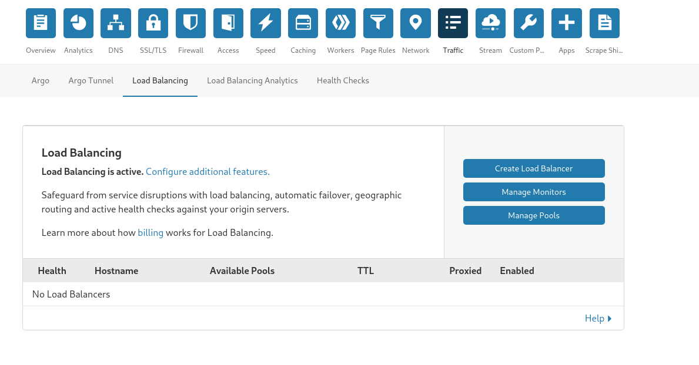
* Select Traffic from the icons
* Click Load Balancing from the list shown after selecting Traffic
* Click Create Load Balancer

Supply the following values for creating the load balancer replacing example.com with your FQDN

wordpress.example.com
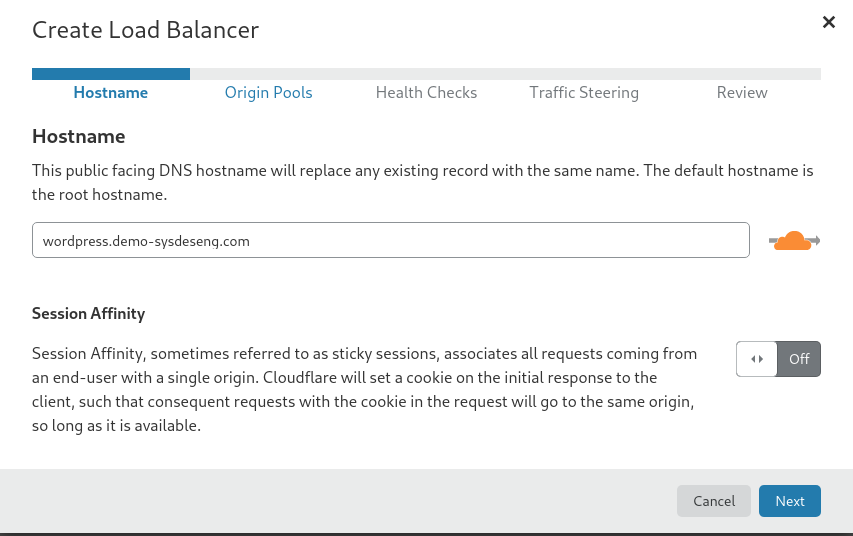

Origin Pool
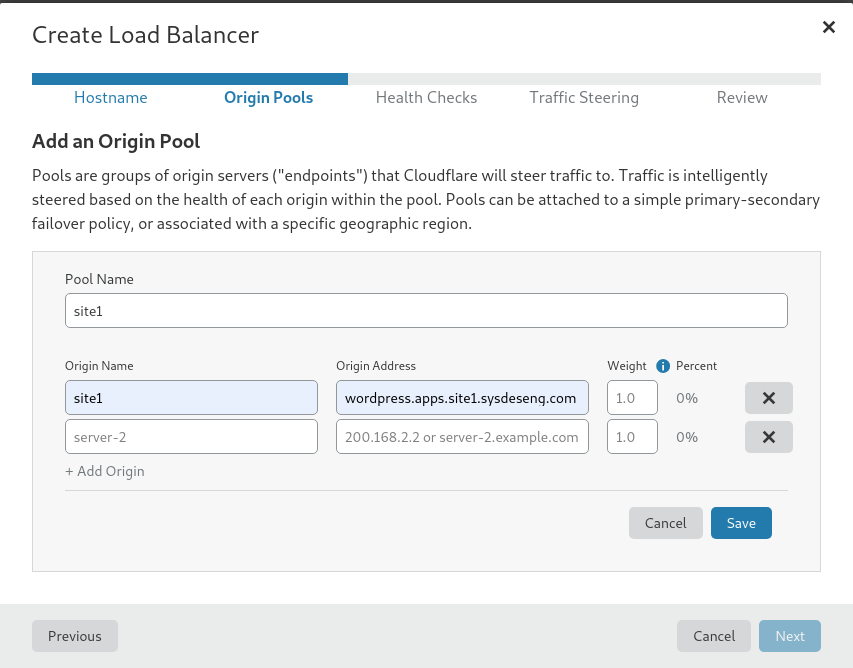

Create a Health Check
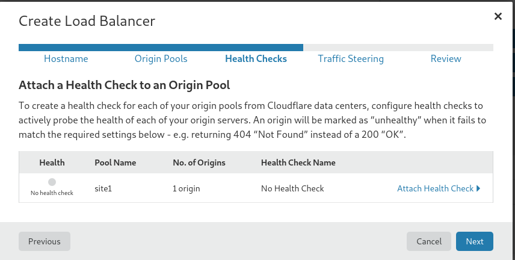

Create a TCP Check
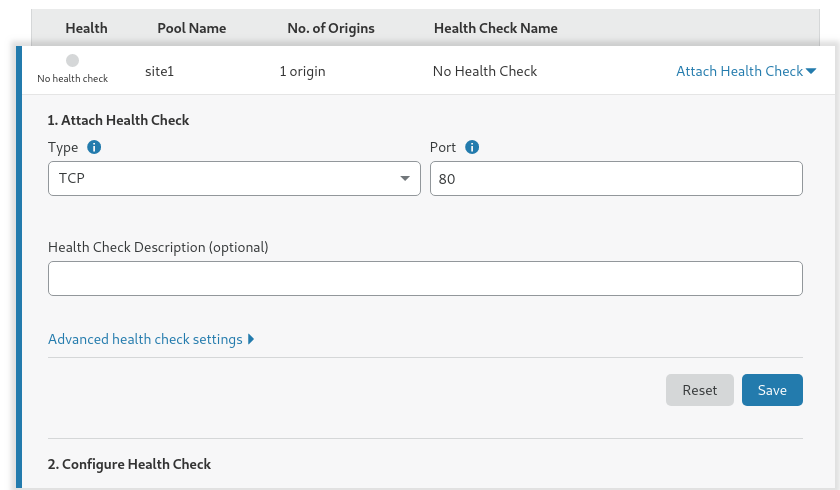

Select off for Traffic Steering
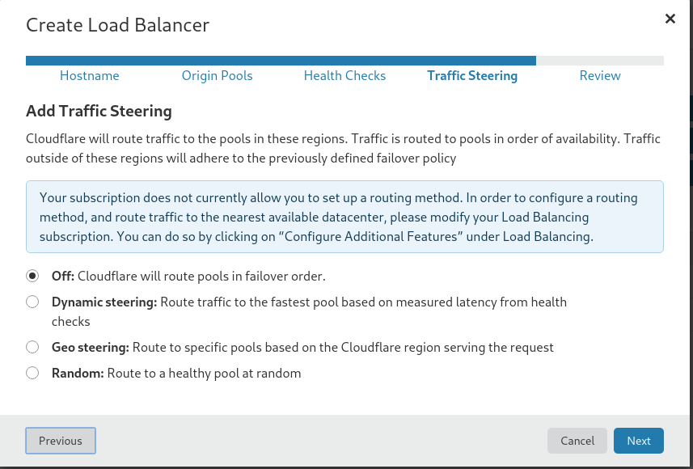

Save and Deploy
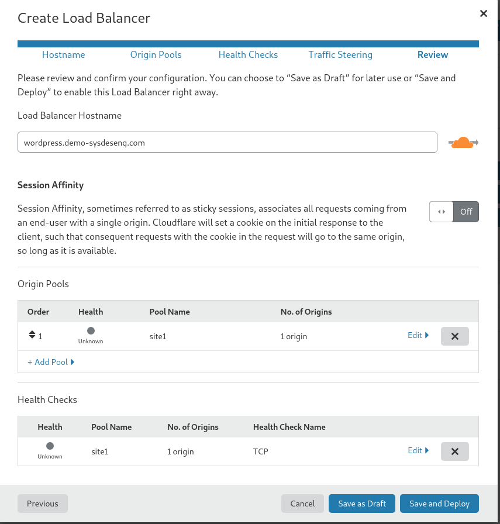

## Modifying the health check
Once the installation of wordpress installation has been completed at site 1. The health check should use a HTTP check rather than TCP.

Perform the following to change the health check.

Click the wrench to edit the load balancer

Select Edit in the Edit Load Balancer Screen
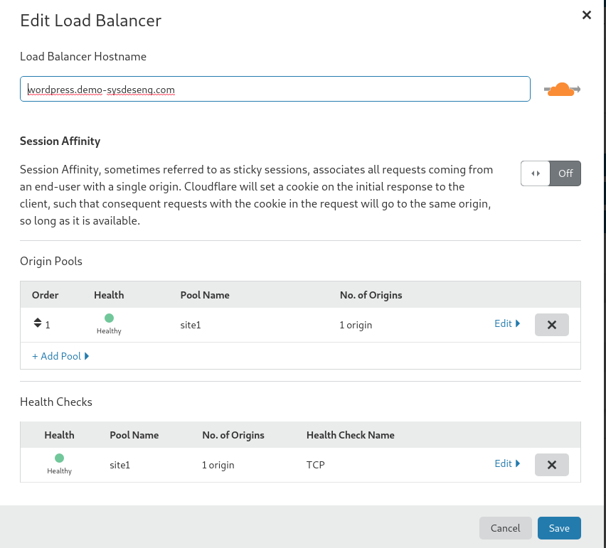

Make the following modifcations and click Save
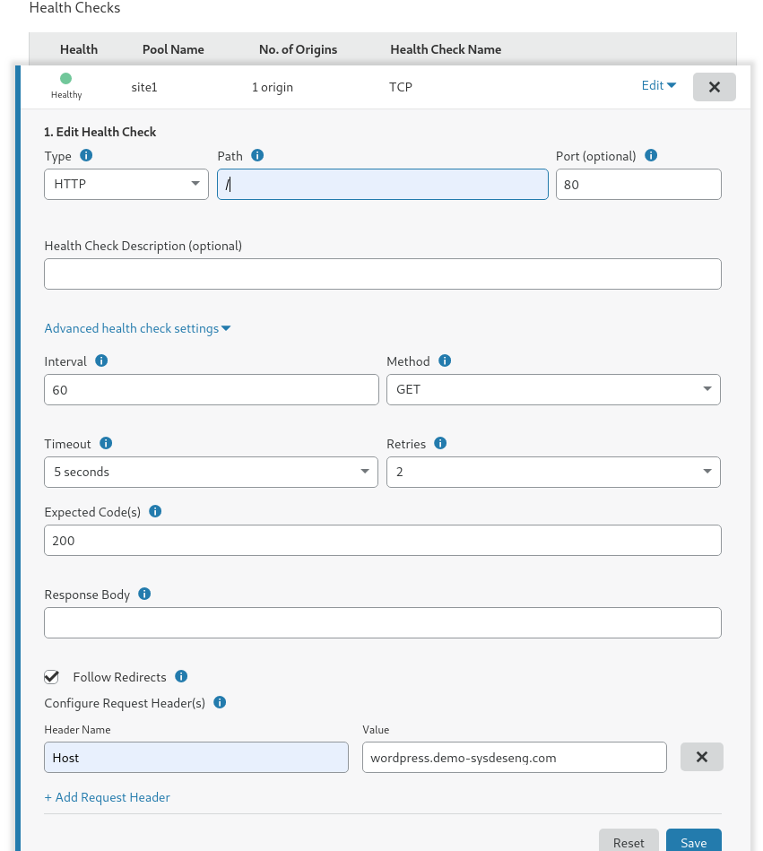

Click save to confirm the modifications which will close the window

## Adding site2
Click the wrench to edit the load balancer

Select Add Pool

Create an origin pool
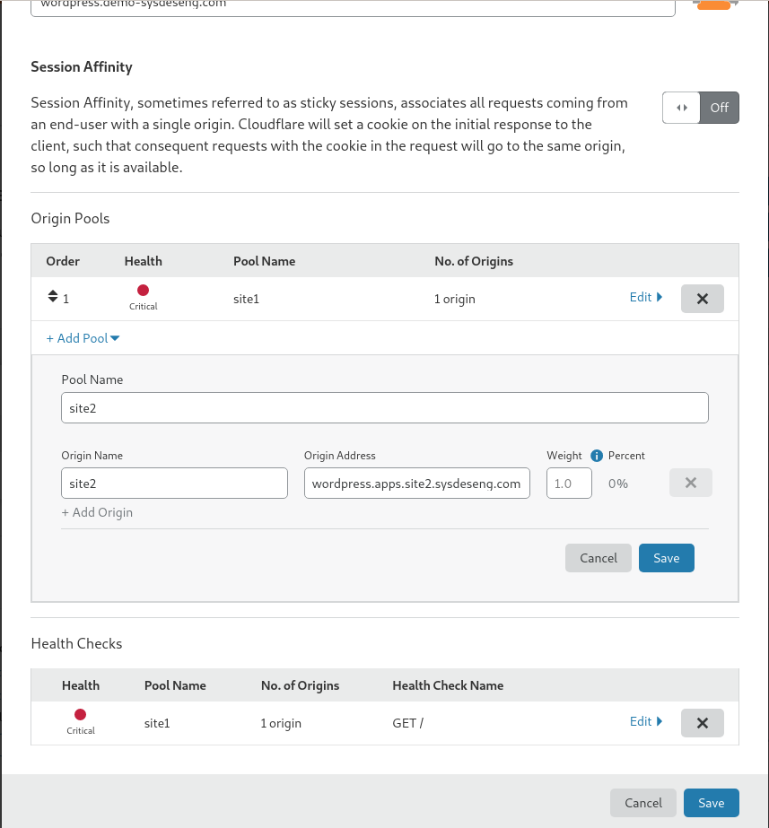

Click save and then click Attach Health Check
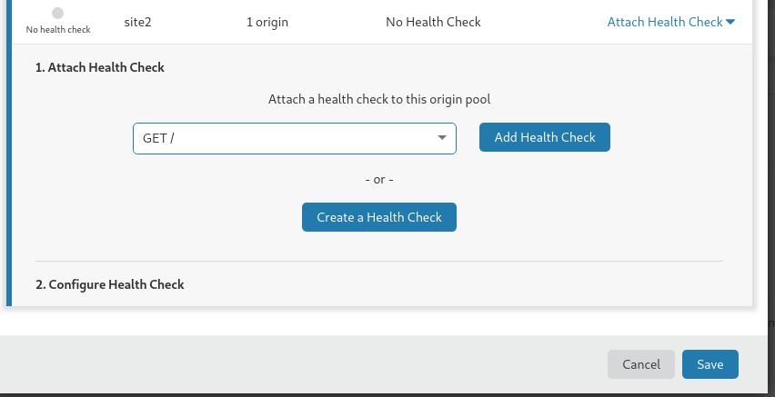

Click save which will save the settings for site2 

# Failing sites
From the load balancing stand point nothing is required to be completed once the two pools have been added and the health check is in place. The GLB will route traffic to the site that has wordpress running.
